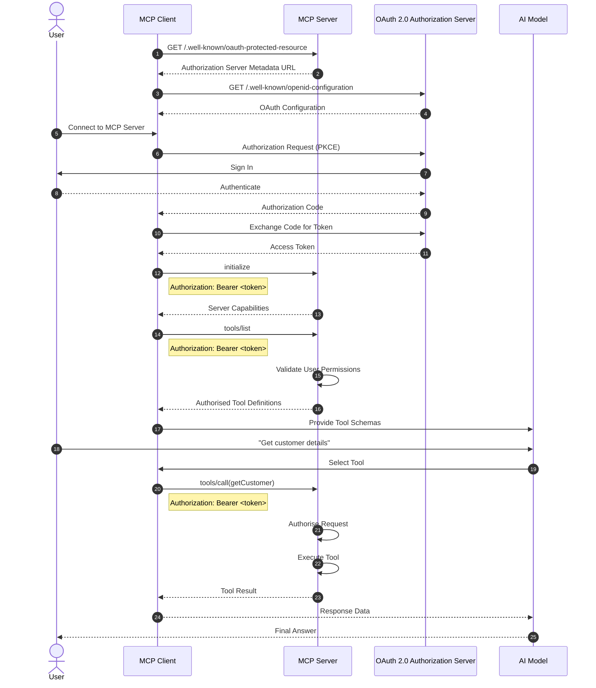

# MCP Explained: The Missing Piece Most Introductions Skip

I've spent a fair amount of time recently working with the Model Context Protocol (MCP), and I kept running into the same problem.

There are plenty of articles explaining *what* MCP is, but very few explaining how it actually works in a real-world implementation.

Most explanations stop at:

> "MCP allows AI models to connect to tools."

While that's technically true, it leaves engineers with more questions than answers.

How does a MCP client discover tools? When does authentication happen? Does the AI know about every tool up front? How does authorisation work? What role does OAuth play?

After digging through specifications, implementations, and building my own understanding, I wanted to write the explanation I wish I had found earlier.

## MCP Is More Than AI Calling APIs

A common misconception is that MCP is simply a protocol for letting AI call APIs.

A better way to think about it is:

> MCP provides a standard way for AI applications to discover, understand, and invoke capabilities exposed by external systems.

Instead of hardcoding tool definitions into every AI application, the client can dynamically learn what capabilities are available from a server.

The key word here is **discover**.

That single concept explains much of how MCP works.

## The Actors

At a high level there are four participants:

* The User
* The MCP Client
* The MCP Server
* The Identity Provider (OAuth / OpenID Connect)

The MCP Client could be ChatGPT, Copilot, Claude Desktop, VS Code, or your own custom application.


The MCP Server exposes capabilities. In other words, the server publishes a set of tools that clients can discover and invoke.

To make this concrete, imagine a Service Desk MCP Server offering tools such as Search Customer, Create Ticket, Delete Customer, and Reset Password. The client does not necessarily know about these tools ahead of time, it discovers them dynamically from the server.

## The Question Most People Ask

The first thing I wanted to understand was:

> Does tool discovery happen when the MCP Client starts up, or when a user connects?

The answer is important because it affects security, authorisation, and user experience.

Going back at our example above, if an MCP Server exposing the following tools:

* Search Customer
* Create Ticket
* Delete Customer
* Reset Password

Should every user see all four?

Certainly NOT!

A support engineer may only be allowed to search customers and create tickets, while an administrator can access everything.

This means tool discovery becomes more than a technical (pre user) operation.

It becomes an authorisation decision.

## Discovery Is Usually User-Aware

In enterprise environments, tool discovery should happen after the user has authenticated.

The MCP Client first obtains an access token representing the user. It then uses that token when communicating with the MCP Server.

The server evaluates the user's permissions and returns only the tools they are authorised to use.

This means two users connecting to the same MCP Server may see completely different capabilities.

The AI is not discovering *all* available tools.

It is discovering the tools available to *that user*.

## Where OAuth Fits In

Another area that often causes confusion is authentication.

A common implementation pattern is for the MCP Server to expose a well-known endpoint describing how authentication should occur.

The MCP Client retrieves this metadata, discovers the authorisation server, and performs a standard OAuth 2.0 flow.

Once authentication is complete, the client receives an access token.

Every subsequent MCP request includes that token:

```http
Authorization: Bearer eyJ...
```

The token becomes the user's identity throughout the MCP session.

## End-to-End Flow

The following sequence illustrates a typical authenticated MCP interaction.



## Discovery Is Not Security

One important detail is that hiding a tool from discovery should never be your only security control.

A secure MCP Server performs authorisation during both discovery and execution.

A useful way to think about it is:

> Discovery determines what a user can see. Execution determines what a user can do.

Even if a user somehow attempts to invoke a tool directly, the server should still validate permissions before execution.

Tool discovery and tool authorisation are related, but they are not the same thing.

## The Mental Model That Made It Click

The easiest way I have found to explain MCP is to compare it to onboarding a new employee.

When someone joins a company, they don't instantly know every system and every capability available to them.

First they prove who they are.

Then they receive an access badge.

Then they learn which systems they can access.

Only then can they begin performing actions.

MCP works in much the same way.

The AI doesn't arrive with knowledge of your tools. It authenticates, discovers what capabilities are available for the current user, and then invokes those capabilities when required.

Once you start thinking about MCP as a combination of **identity, discovery, and execution**, rather than simply "AI calling APIs", the architecture becomes much easier to understand.

## Final Thoughts

Many MCP introductions focus heavily on tools and not enough on identity.

In practice, identity is often the most important part of the design.

The tools a model can discover, the actions it can perform, and the data it can access are all driven by the identity represented by the access token.

That is why authentication, authorisation, discovery, and execution are closely connected in a well-designed MCP implementation.

Understanding that relationship is the missing piece that many high-level explanations leave out, and it is often the key to understanding how MCP works in real enterprise systems.

## What's Next

In a follow-up post I will put together a concrete, end-to-end Service Desk example: a minimal MCP Server, OAuth configuration, tool schemas (Search Customer, Create Ticket, Delete Customer, Reset Password), and a step-by-step walkthrough showing discovery, authorisation, and execution. If you have a preferred language or platform (Node.js, Python, or .NET), tell me and I will prioritise that in the example.
